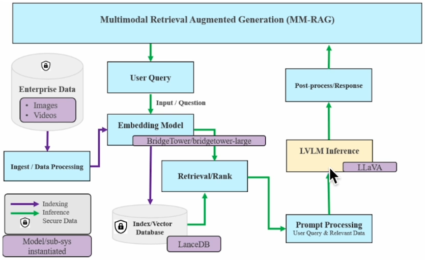
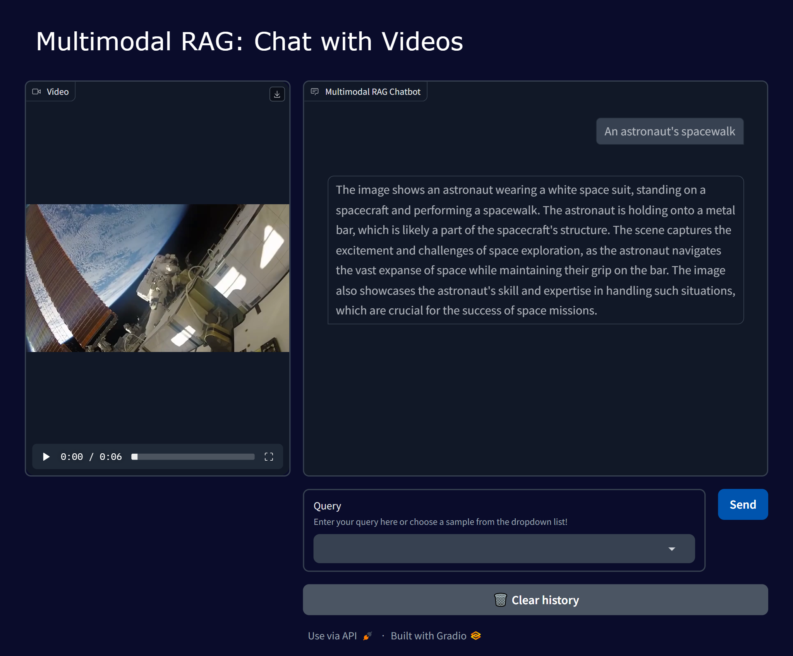

# Project Overview
This is a system that lets you have intelligent conversations about video content. Think of it as a smart video assistant that can understand and answer questions about videos. The system uses a technique called Multimodal RAG (Retrieval-Augmented Generation) to process both visual and audio content from videos.

## Certificate and Images
- **Course Certificate**: View my completion certificate [here](https://learn.deeplearning.ai/accomplishments/12b98ae0-cf49-4aa6-bb0a-7431fa9232a7?usp=sharing)
- **System Architecture**: 
- **Web Interface**: 

# How It Works
The system processes videos in three main steps:

## Step 1: Video Processing
The system can handle three different types of videos:

1. Videos with transcripts:
   - Uses OpenCV to extract frames at specific timestamps
   - Matches each frame with its corresponding transcript text
   - Saves metadata like frame location, transcript text, and timing information

2. Videos with audio but no transcript:
   - Uses OpenAI's Whisper model to create a transcript from the audio
   - First extracts the audio using MoviePy
   - Converts the transcript into a structured format (WEBVTT)

3. Silent videos (no audio or transcript):
   - Extracts frames from the video
   - Uses LLaVA model to generate descriptions of what's happening in each frame

## Step 2: Database Creation
- Uses the BridgeTower-large model to create embeddings
- Stores everything in a LanceDB database
- Improves transcript quality by combining text from neighboring frames
- Allows for customization of how many neighboring frames to consider

## Step 3: User Interaction
The system offers two ways to interact:

1. Python Program Interface (3a):
   - Run queries through code
   - Get text responses with relevant images

2. Web Interface using Gradio (3b):
   - User-friendly web interface
   - Can ask follow-up questions about the same video
   - Has a "Clear history" button to start fresh queries

# Setup Requirements
To use this system, you need:
- An OpenAI API key (get from platform.openai.com/login)
- A Prediction Guard API key (get from predictionguard.com/get-started)

# Important Note
If you're using a free Prediction Guard API key, there's a rate limit of 1-2 requests per second. The system includes delay timers (`time.sleep(1.5)`) to handle this. If you have a paid key without limits, you can remove these delays for faster performance.

The system uses LangChain to combine different components using this structure:
```python
mm_rag_chain = (
    RunnableParallel({
        "retrieved_results": retriever_module,
        "user_query": RunnablePassthrough()
    })
    | prompt_processing_module
    | lvlm_inference_module
)
```

This system was created as part of a DeepLearning.AI course on Multimodal RAG systems, focusing on video content interaction.

Would you like me to explain any specific part in more detail?
